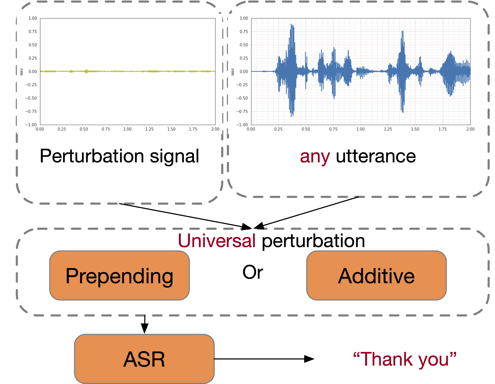

# Targeted Universal Adversarial Perturbations to End-to-end ASR Models

Authors: {zhiyunlu,weihan,ngyuzh,llcao}@google.com

This pages demonstrates some examples of targeted universal adversarial
perturbations to e2e ASR models. Details can be found in the paper
[Exploring Targeted Universal Adversarial Perturbations to End-to-end ASR Models](https://arxiv.org/abs/2104.02757).

[TOC]

## Abstract

{style="float: right"}
Although end-to-end automatic speech recognition (e2e ASR) models are widely
deployed in many applications, there have been very few studies to understand
models' robustness against adversarial perturbations. In this work, we explore
whether a targeted universal perturbation vector exists for e2e ASR models. Our
goal is to find perturbations that can mislead the models to predict the given
targeted transcript such as "thank you" or empty string on any input utterance.

We study two different attacks, namely additive and prepending perturbations,
and their performances on the state-of-the-art LAS, CTC and RNN-T models. We
find that LAS is the most vulnerable to perturbations among the three models.
RNN-T is more robust against additive perturbations, especially on long
utterances. And CTC is robust against both additive and prepending
perturbations. To attack RNN-T, we find prepending perturbation is more
effective than the additive perturbation, and can mislead the models to predict
the same short target on utterances of arbitrary length.
